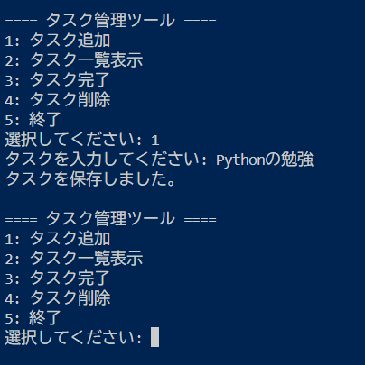

# Python Task Tool (CLI App)

## English

### Overview

A simple task management tool that allows you to add, complete, and persist tasks using a JSON file.
This is a simple task management tool built with Python.

It allows users to create, manage, and store tasks using a JSON file, making it a lightweight and practical productivity tool.

## Example

1. Add task
2. Show tasks
3. Complete task

> Add task: Study Python
> Task added!

- [ ] Study Python

### Features

- Add new tasks
- Mark tasks as completed
- Save tasks automatically using JSON
- Load tasks on startup

### Use Case

This tool can be used for:

- Personal task management
- Learning basic CRUD operations
- As a base for automation tools

### Tech Stack

- Python
- JSON

### Project Structure

- main.py : application logic
- tasks.json : data storage

### How to Run

python main.py

### Screenshot

---

## 日本語

### 概要

Pythonで作成したシンプルなタスク管理ツールです。  
JSONファイルを使ってタスクを保存・管理できます。

### 機能

- タスクの追加
- 完了状態の管理
- JSONでの保存・読み込み
- シンプルな操作

### 用途

- 個人のタスク管理
- CRUD処理の学習
- 自動化ツールのベース

### 技術スタック

- Python
- JSON

### 構成

- main.py : アプリ本体
- tasks.json : データ保存

### 実行方法

python main.py

### スクリーンショット

